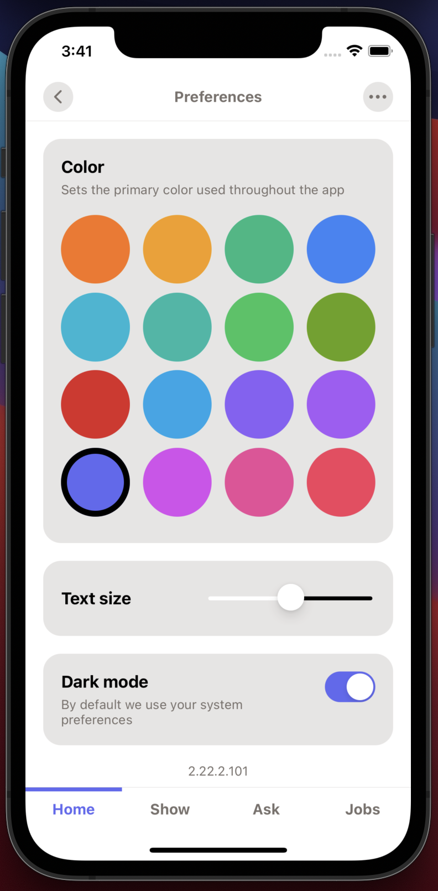
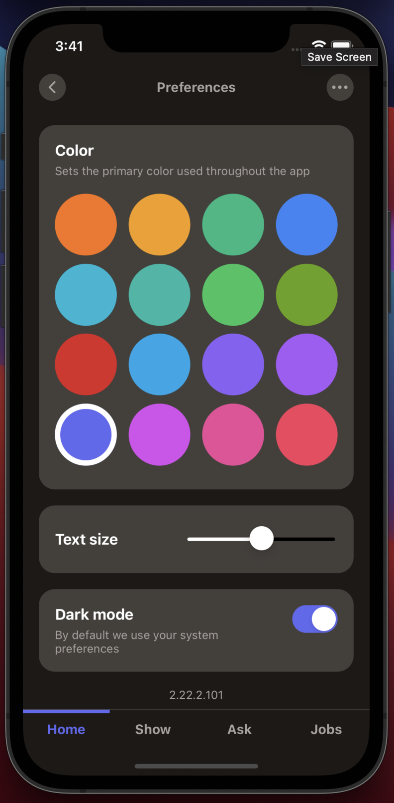

# Hacker News

> A Hacker News app written in react-native and [Dash](https://github.com/dash-ui/react-native)

 

## Getting started

```sh
# Clone the repo
git clone https://github.com/jaredLunde/react-native-hacker-news
# Enter the new directory
cd react-native-hacker-news
# Install and start an iOS app
yarn && yarn ios
```

## Scripts

| Script        | Description                                     |
| ------------- | ----------------------------------------------- |
| `dev`         | Runs the development environment                |
| `android`     | Start developing the android app in an emulator |
| `check-types` | Type checks the project                         |
| `ios`         | Start developing the iOS app in an emulator     |
| `lint`        | Runs ESLint on the project                      |
| `test`        | Runs Jest on the project                        |
| `web`         | Start developing the web app in the browser     |

---

 

---

 

---

 

---

 

---

 

---

 

---

 
